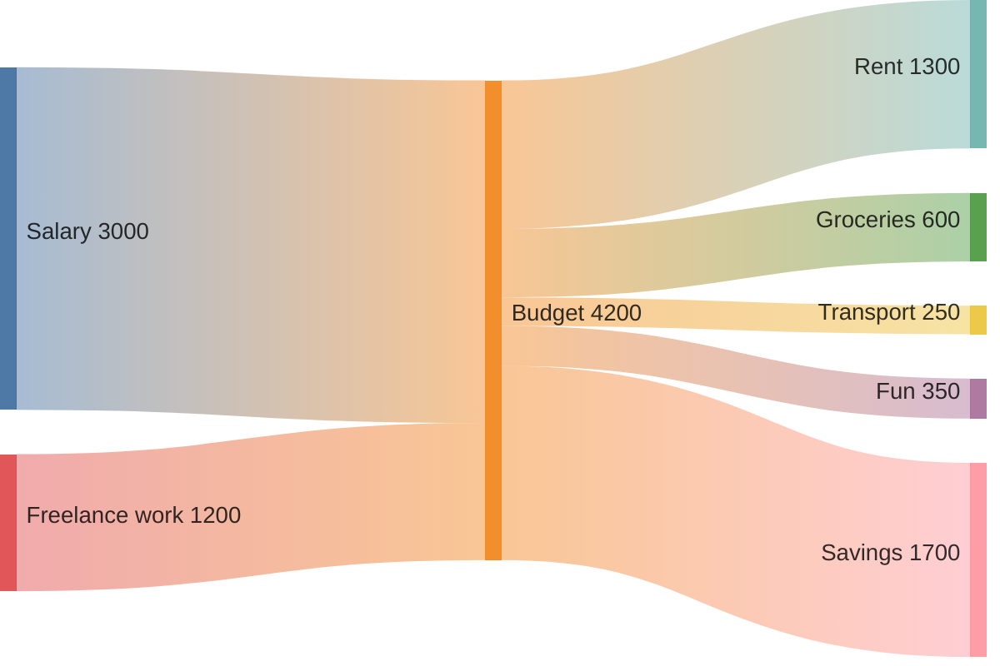

# [Titulo](#Titulo) 



```cpp
Sample c++ code
```

> Loresu plus\
> `1+1+3`

---
excerpt_separator: <!--more-->
---

Excerpt with multiple paragraphs

Here's another paragraph in the excerpt.
<!--more-->
Out-of-excerpt